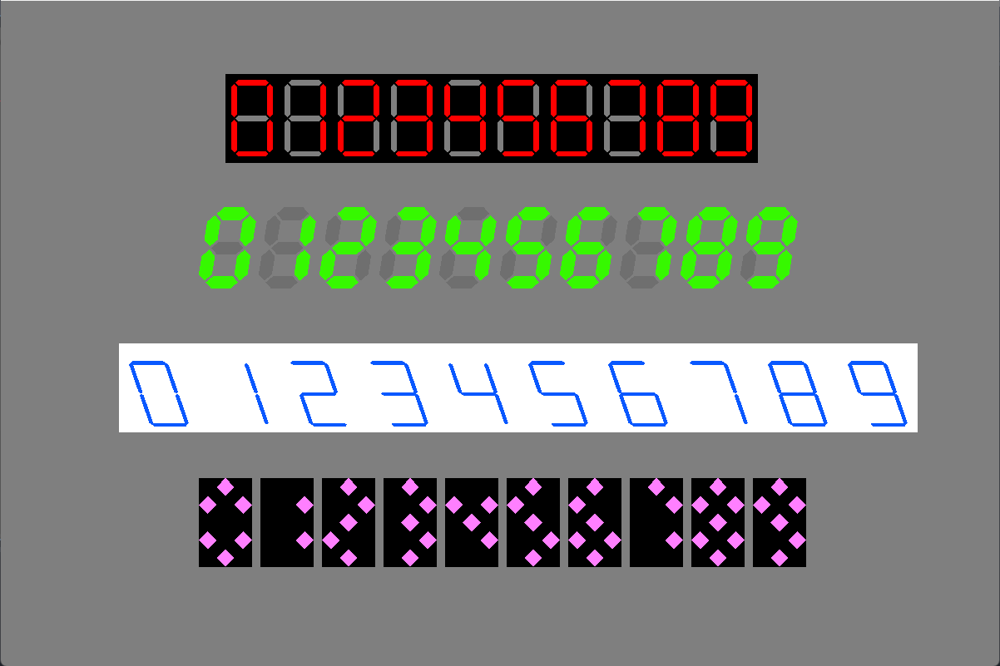

# 7-segment-display-shader-demo
A demo project of the 7-segment display shader for Godot Engine.

The shader file is also available on [GodotXC](https://godotxc.com).

Please refer to [note](./note/7seg_note.md) for details of the shader calculations.

Compatible Versions: 4.0, 4.1
