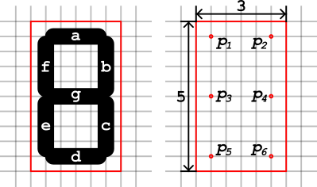
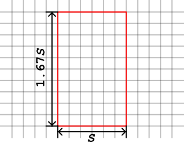
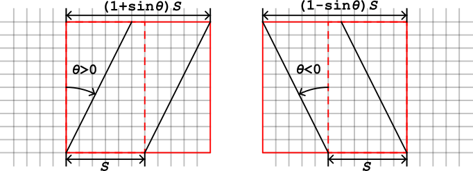
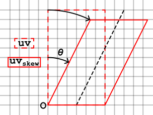
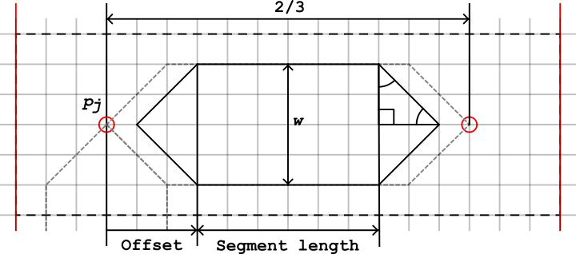

# 7-segment display shader math note

## Uniform parameters

- **float** SkewAngle $(\theta)$
- **float** Size $(S)$
- **float** SegmentWidth $(w)$
- **float** SegmentOffsetRatio $(r)$
- **int** Number (0~9)
- **bool** On
- **vec4** SegmentOnColor
- **vec4** SegmentOffColor
- **vec4** BackgroundColor

## 7 segment display

---

## Vertex

## UV

---

## Segment

$\rm{Segment\ offset} = (1 + r) \times w / 2$

$\rm{Segment\ length} = 2 / 3 - 2 \times \rm{Segment\ offset}$

## Functions

### skew

$x_s = x + y \sin \theta$

$y_s = y \cos \theta$

$$x = x_s - y_s \tan \theta$$

$$y = \frac{y_s}{\cos \theta} $$

### rotation

$x_r = x \cos \theta - y \sin \theta$

$y_r = x \sin \theta + y \cos \theta$